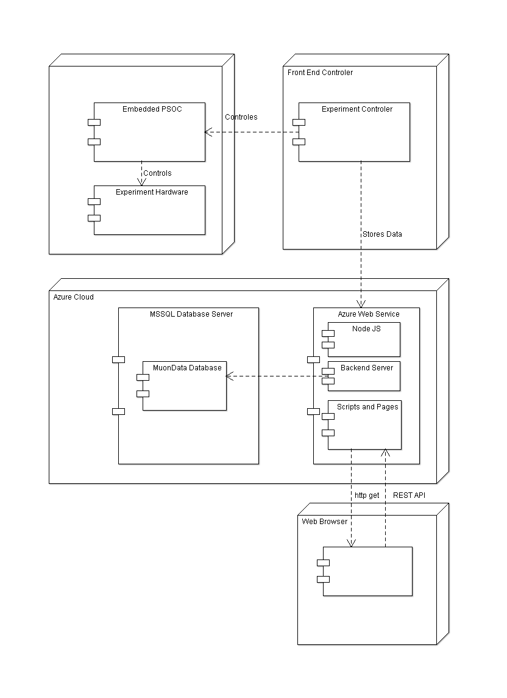

# The Muon Gateway

The Muon Data gateway is a small server which allows on one hand to display the
data collected by the Muon Correlation Experiemnt and to derive from it random
number tables. On the other hand the server provides a REST api for the
experiment controler to store the measured data in a MSSQL database.

## Deployment Overview

